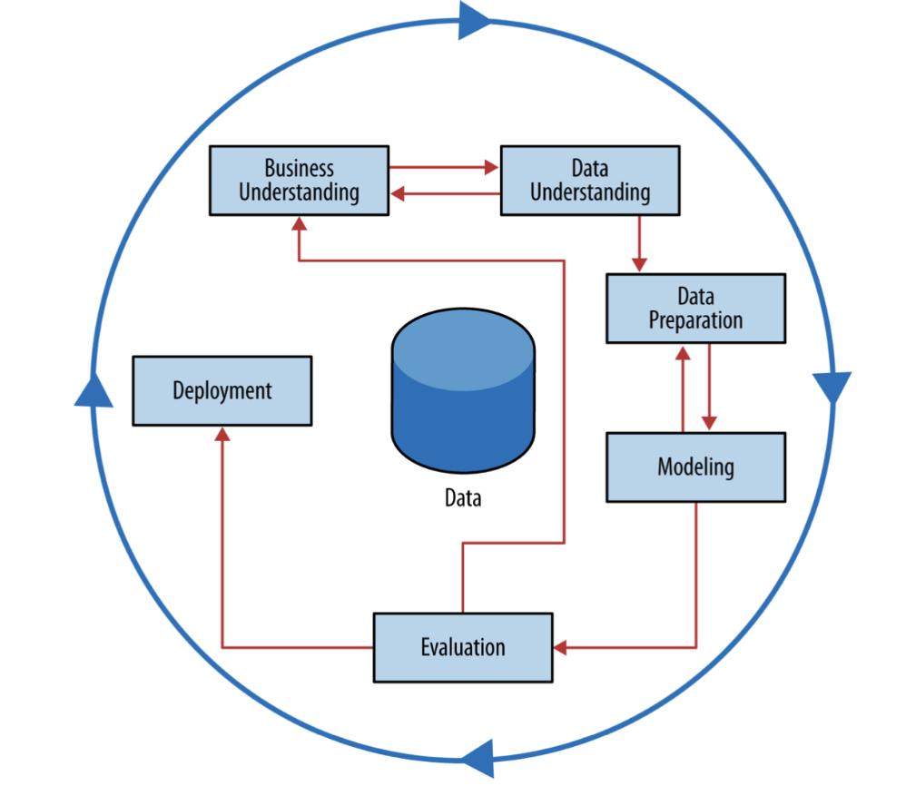
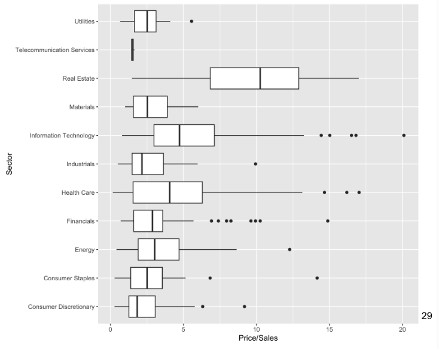
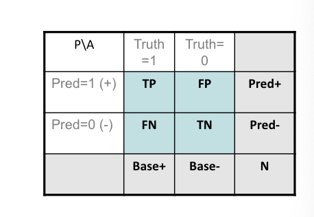
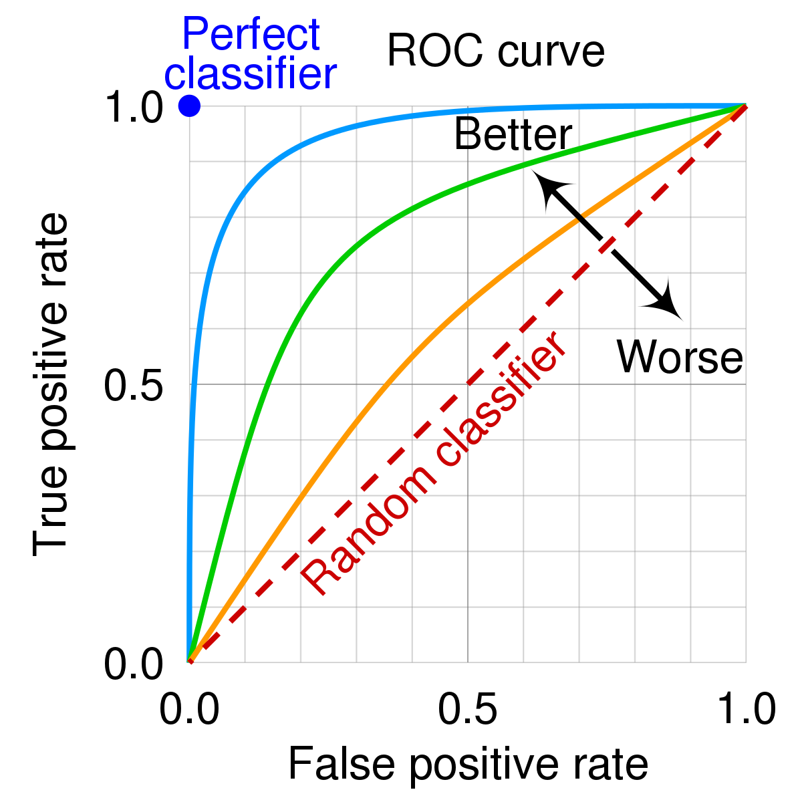
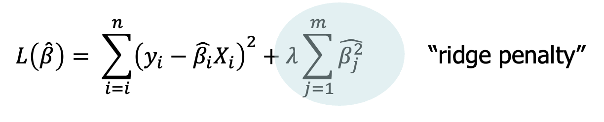
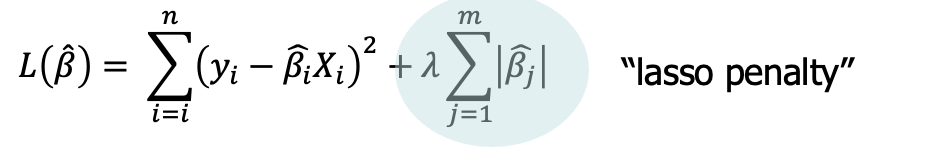
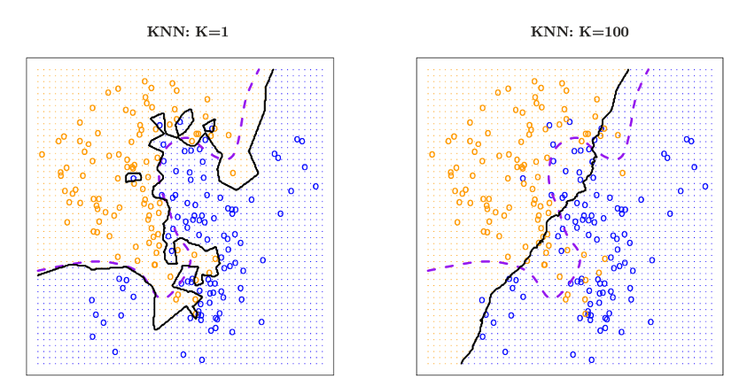

# Data-Science-for-Business-Techincal

**Table  of contents**
- [Data-Science-for-Business-Techincal](#data-science-for-business-techincal)
- [1 Intro to Data Science](#1-intro-to-data-science)
  - [1. 1 Taxonomy](#1-1-taxonomy)
- [2 Managing Data](#2-managing-data)
  - [2.1 Basics](#21-basics)
  - [2.2 Data Visualization](#22-data-visualization)
    - [**Multiple variables**](#multiple-variables)
- [3 Decision Tree](#3-decision-tree)
  - [3.1 Supervised classification](#31-supervised-classification)
  - [3.2 Growing a tree](#32-growing-a-tree)
    - [**Measuring Impurity**](#measuring-impurity)
    - [Measuring coverage](#measuring-coverage)
- [4 Fitting and Evaluation of Models](#4-fitting-and-evaluation-of-models)
    - [Validation set](#validation-set)
    - [Cutoff choice](#cutoff-choice)
    - [FP and FN](#fp-and-fn)
    - [Confusion Matrix](#confusion-matrix)
    - [Classifier Eval Metrics](#classifier-eval-metrics)
  - [Cross validation](#cross-validation)
    - [Grid search](#grid-search)
- [T5 Evaluation](#t5-evaluation)
- [T6 Linear Classification \& Regression](#t6-linear-classification--regression)
- [T7 Feature Engineering \& Variable Selection](#t7-feature-engineering--variable-selection)
- [T8 Similarity, Neighbors and Clustering](#t8-similarity-neighbors-and-clustering)
  - [8.1 Similarity](#81-similarity)
  - [8.2 kNN](#82-knn)
  - [8.3 Unsupervised Learning - Clustering](#83-unsupervised-learning---clustering)
- [Topic 9 Modeling Text Data](#topic-9-modeling-text-data)

---

# 1 Intro to Data Science

**Data Science Process: CRISP**

CRISP: Cross-Industry Standard Process



**Business understanding, Data Understanding, Data Preparation, Modeling,** 

**Evaluation:** RMSE, Accuracy, ROC Curves; **Deployment**

## 1. 1 Taxonomy

**Predictive vs Descriptive Model**

- Clustering is a descriptive model, while most DS algos are predictive.

**Supervised vs Unsupervised**

- **Unsupervised learning:** Customer segmentation via clustering
- **Supervised learning:** Predicting Customer Spending
  - Classification, regression, time series, etc.

# 2 Managing Data

## 2.1 Basics

**Find the Data**

We can use scrapers, parsers, companies’ APIs, and other tools like “beautiful soup” to **find data**.

**Exploring Data**

**Exploratory Data Analysis is prior to any modeling**

- Summaries, outliers, missing data, correlations[-1,1]

**Types of Data**

Structured, unstructured, time series, text, image, media, spatiotemporal, network-based…

**Feature types**

- Numeric

  - Numbers, dates

- Categorical/Nominal

  - Multi-valued, numeric labels
  - **Ordinal:**  (Ordered), Income
  - **Nominal:** Eyecolor, gender, pets..

- Binary

- Datestamps

  use `import datetime` 

**Some data operations in python**

- rename var - `.rename`
- slices of data - `.loc`
- summaries of var - `.info` `.describe`
- categorical var - `.value_counts`
- explore data - `.head` `.tail`
- merge or split attributes - `.concat` , `.split`
- If data too large - `.sample`

**Categorical Variables**

- Recode variables as binary

```python
pandas.get_dummies(drop_first = TRUE)
sklearn.preprocessing.OneHotEncoder
```

- When categories is too many, we can transform them into top levels + “other”
- Outliers should always be considered and inspected to see if they are “real” or some artifact of data collection
- Python uses `NaN` for **missing data**, use `isnull()` and `notnull()`  to detect missing values
- Reasons for missing data
  - data entry errors, non-responses in surveys, system errors, etc.

**Why identifying missing values is crucial?**

- Data integrity, quality analysis, model performance

**Strategies for missing data**

- **Deletion methods**
  - Listwise: remove entire rows where any value is missing, `dropna()`
  - Pairwise: use available one, ignore the missing one
- **Imputation methods**
  - Mean/Median/Mode imputation, `fillna()`
  - Predictive modeling
    - Use algos like regression or KNN to predict and fill missing values
  - Multiple imputation
    - A more advanced technique that imputes values multiple times to account for the uncertainty of missing data

## 2.2 Data Visualization
| Plot Type     | Pros/Advantages |
|---------------|-----------------|
| Bar Chart     | Easy to compare different groups; suitable for displaying differences in quantities among categorical data. |
| Line Chart    | Ideal for showing trends over time; can display multiple series simultaneously; clear visualization of changes and patterns. |
| Scatter Plot  | Good for visualizing the relationship between two continuous variables; can identify correlations and outliers. |
| Histogram     | Useful for showing the distribution of a continuous variable; helps in understanding the data distribution. |
| Box Plot      | Excellent for displaying data distribution based on a five-number summary; useful for detecting outliers. |
| Pie Chart     | Effective for showing relative proportions of a whole; best with limited categories. |
| Heat Map      | Good for showing magnitude as color in two dimensions; useful for correlation matrices, geographical data. |
| Area Chart    | Similar to line charts but emphasizes magnitude; useful for comparing quantities over time. |
| Violin Plot   | Combines box plot and kernel density plot; offers deep insight into distribution density. |
| Bubble Chart  | Similar to scatter plot but adds a dimension with bubble size; useful for comparing three data variables. |
| Stacked Bar Chart | Shows total and relationships between parts; useful for comparing cumulative effects. |


**Boxplots IQR(Interquartile Range)** = 75% - 25%

**Acceptable Range = 1.5 * IQR, data that fall outside of this range considered outlier.**

### **Multiple variables**

**Categorical, 3 ways to present contingency tables**

1. Stacked bar
2. Side-by-side bar
3. Standardized bar

**Categorical and numeric**

Side by side box plots allow you to compare numeric distributions across variables which are categorical.



**Scatterplot**

Scatterplot is the standard tool to display relation between 2 variables. Find correlations, patterns and outliers.

# 3 Decision Tree

## 3.1 Supervised classification

Decision tree is also called classification tree.

The leaf has 0 or 100% probablity: **Laplace Correction,** p(c) = (n+1)/(N+2)

## 3.2 Growing a tree

Good split: “purity” of the branches, “coverage” of data

### **Measuring Impurity**

- The more homogeneous (consistent) a group is, the more pure it is.
- **Entropy:** - p1 log2(p1) - p2 log2(p2)
- Entropy is maximized when classes equal
- A **decrease** in entropy means more info
- Overall entropy of split is a weighted average of the two
- split by different features can bring different purity

### Measuring coverage

Information Gain = Impurity(parent) - impurity(children)

We will stop growing a tree, when:

1. we have perfect purity
2. No split add more information

**Recursive algorithm** that keeps splitting until done

Every iteration: pick split over all current leaf nodes over all possible attributes - uses information gain as a measure of improved purity

# 4 Fitting and Evaluation of Models

**Complexity vs. Error**

Overfitting: model is too complex: the model fits great On the training data but doesn’t generalize to holdout data because it is "memorizing" the training data.

- The increase of model complexity will decrease the error on training set, but not necessarily on testing/holdout set.
- We can use the complexity tradeoff to find the best size for a tree

**Cross-validation**

1. Split into K-folds

   ```python
   from sklearn.model_selection import cross_val_score
   cross_val_score(model, X, Y, scoring="accuracy", cv=5)
   ```

2. LOOCV(Leave One Out Cross Val)

   - Fit one datapoint each time, N time, best est. True Error
   - Can be time consuming

   ```python
   from sklearn.model_selection import LeaveOneOut, cross_val_score
   loo = LeaveOneOut()
   cross_val_score(model, X, Y, scoring="accuracy", cv=loo)
   ```

### Validation set

In cases where accurate estimation of the performance is critical, it may be useful to create a ***third*** partition of the data

- 60%training, 20% test, 20% validation

### Cutoff choice

- or a classification model, the cutoff used has an impact on the overall error

### FP and FN

- False positive (FP): we predict “positive” when it is not true
- False negative (FN): we fail to predict “positive” when we should have

### Confusion Matrix

A way is a way of presenting the FN and FP rates for a given prediction

- accuracy = (TP + TN) / n
- different cutoff generates different confusion matrix
- Loop thru different cutoff to get different matrices and accuracy, and give the best cutoff



### Classifier Eval Metrics

- Accuracy: (TP+TN) / n
- Error Rate: (FP + FN) / n
- Precision(Exactness): TP / predict_true
  - What % of times we label positive are we correct?
- Recall: TP / Base+
  - how many of the positives did we predict?

- Accuracy: (90+9560)/10000 = 0.965
- Error: 350 / 10000 = 0.35
- Precision: 90/230 = 0.39
- recall: 90 / 300 = 0.30

**Base rate: all true cases / all cases**

We have more than accuracy to eval the model, so to avoid 

## Cross validation

**ROC**: A Receiver Operating Characteristic (ROC) curve is a graph that shows the performance of a binary classification method. It plots TPR vs. FPR.


**AUC**: "Area under the ROC Curve"

### Grid search

# T5 Evaluation


# T6 Linear Classification & Regression

Linear classification is achieved via Linear Discriminant: Class(x) = 1._ 2._ 

`from sklearn.discriminant_analysis import LinearDiscriminantAnalysis` 

**SVM**

The optimal SVM is the boundary that maximizes the margin. 

`from sklearn import svm`

Complexity parameters of SVM:

1. C: The cost. Higher C fits training data more closely
2. Kernel: Linear or non-linear with degree of polynomial

**Regression Models**

Prediction variable is numeric - continuous. Decision Tree is a classification models, NOT regression.

**Regression Trees**

`from sklearn.tree import DecisionTreeRegressor`

**Linear Regression**

`from sklearn.linear.model import LinearRegression`

- Linear Regression is to predict a numeric variable from one or multiple variables(which can be numeric or categorical)

**Linear Relationships**  $Y = \beta_0 + \beta_1 X$

Correlation coefficient `r_xy` :

- 0 means no relation, -1 means negative, 1 means postive relationship
- Least squares regression line is the line that minimizes the sum of **squared** residuals (Make errors don’t cancel out)
- use `statmodels` to get regression output
- $\beta_0$ is the Y-intercept. It is not reliable if it’s outside the range of data (Extrapolation)
- The interpretation of beta_1 can’t be casual

**Regression concerns**

- Violations of assumption: linear relationship, normality of residuals, constant variance
- Regression can be sensitive to: outliers, leverage points, highly correlated predictors

**Logistic Regression**

`from sklearn.linear_model import LogisticRegression`

**Loss function**

Linear Regression - Squared-error loss, Logistic Regression - Logistic Loss

**Complexity** 

More attributes means more complex relationships. Categorical variables can explore dimensionality. 

**Reduce complexity:** 1. Reduce the number of attributes(Variable selection); 2. Use a penalty in the objective function(Regularization).

**Regularized Regression:** The least squares regression line is the line that minimizes the sum of the **squared** residuals.

Ridge/L2 regression: Estimates are squared.

Lasso/L1 regression: Estimates are absolute value.



**λ is the penalty parameter**, protect us from overfitting.

Regularization is also referred to as **shrinkage.**

λ = 0 means no regularization, larger is stronger penalty, can be determined by cross-validation.

**Lasso Regression:** the lasso will “shrink” parameter estimates towards zero, has same effect as variable selection.

# T7 Feature Engineering & Variable Selection

- Add attributes: feature construction, feature engineering
- Remove attributes: dimension reduction, variable selection

**Example1**: Predict whether a customer will respond to a special offer, based on previous purchases

- We want every entry to be every people, and to avoid redundancy
- Eg. Turn 10 purchases entry into 1 purchase sum amount

**Example2 Netflix prize:** Predict if someone’s gonna like Jurassic Park

**Things to do before modeling**

- Categorical → dummies, numeric → categorical: highest 10%, or H/M/L categories, binning of target or attribute for long tail
- strings → date variables, extract year/month/day from data
- Combine columns: mean, max, min or total might be more relevant
- Standardize features:
  - `StandardScaler` : Converts to Z-Scorel, MinMaxScaler, to [0,1]

**Example3: Network data: Top 2 buddies were more predictive than anything else**

- Why removing unimportant attributes?

  Model accuracy, overfitting, efficiency, interpretability, unintended data leakage

**Feature selection by Addition**

Identify each feature’s impact: correlation, ROC curve, information gain, regression table - find all of the significant features and remove non-sigs

- Can also do this iteratively, if there is collinearity

**Iterative feature subtraction**

Backward elimination(Regression): Improve $R^2$ every step til none of the remaining variables when removed increase $R^2_{adj}$

- In every iteration, when the process suggests removing a categorical variable, it means removing all its dummy variables (levels) at once, not just one(e.g. Removing is_red, is_blue, is_fellow all together for color)

- L1 Regularization is another way to reduce the number of features



  Use CV to find the best value of lambda, fit data with optimal lambda, remove features w/ coefficient = 0

**Example online advertising: Dstillery,** ad targeting inc in NYC

**How to solve cold start?** where we don’t have data yet to train on? What to do if there are very few positive examples? Reducing attribute space? 

- **Feature reduction - Clustering:** Dstillery bought data that allowed them to categorize all URLs into topics

**Dimension Reduction - Principle Components**

- Principal Components Analysis(PCA): High dimensional space → lower
- Take original data and reduct to top principle components, fit regression on PC instead of original data(Variable should be normalized for PCA)

# T8 Similarity, Neighbors and Clustering

## 8.1 Similarity

Use case of similarity in business: Find **similar products** to existing products to identify recommendations; Identify **items/customers** similar to your known. best customers

- Unsupervised learning: Use similarities. to group similar items into clusters

**Distance**

We use normally Euclidean distance to define distance, and we turn non-numeric data into numeric data also for creating distances

**Different types of similarity/distances**

- Numeric Distance: Euclidean, Manhattan, Cosine distance
- Binary vectors: Hamming distance (# of changes from A to B))
- Jaccard similarity: Intersection over union

## 8.2 kNN

kNN is a **supervised classification algorithm** that ignores global structure and simply looks at similarities.

`sklearn.neighbors.KNeighborsClassifier`

**Steps:**

1. Calculate the distance between the target and all examples in the training set
2. Select K examples closest to target in the training set
3. Assign target to the most common class among its K nearest neighbors

- Note that our answer will also depend on the K we choose

**Scaling data before calculating the distance**

- Distance between neighbors will be dominated by attributes with relatively large values
- **Solution - Normalize numeric variables**
  - Scale data between 0(min) and 1(max) - Achieve equal influence
  - Create z-scores by subtracting mean and dividing by standard dev

`from sklearn.preprocessing import MinMaxScale StandardScalar`

KNN is simple to use, and can be used with multiple-class targets, but not efficient and not the best.

**Complexity**



Small `k` tends to overfit the data. (Dashed line is the “Bayes Rate”)

- In optimizing `k` using cv, 1/k is used as the X-axis, since large `k` correspond to low complexity

**kNN as a regression model**

Find the right `k` via cross-validation: us RMSE instead of error rate. `sklearn.kNeighborsRegressor` 

## 8.3 Unsupervised Learning - Clustering

**Distinguish kNN and clustering:** 

- kNN vs Clustering
- Supervised vs unsupervised; Output label or value vs. output sets of clusters; classification or regression vs. exploring patterns; No fitting models vs need training model

**Clustering is used:** Customer segmentation, recommendation algorithms, ident of fraud or risk, clustering documents for information retrieval

Two basic types of clustering: centroid based(aka partitional); Hierarchical

Clustering assumes that each observation falls into only one cluster.

- All data can be clustered, but clusters don’t always make sense!

**K-means clustering** `sklearn.cluster.KMeans` (center-based)

1. Pick the # of clusters - k
2. Start with some guess as to the cluster centers
3. Iterate between: classifying each points to clusters; recalculate cluster centers(centroids)

- Check out `Module6_similarity/kmeans_clustering.ipynb`

Discussion: K-means clustering applies to fairly large data sets, sensitive to initial centers, converges to local optimum, K choice can be subjective

**Hierarchical Clustering**

- Start with n clusters, and progressively merge data until you have one cluster

**Dendrograms**

- Dendrograms are a visual representation of the hierarchical clustering process, and closets points get connected lower in the dendrogram.
- You can partition your data into any number of clusters in [1,n] by different result cuttings

HC tends to have low stability, results depend on linkage(minimum), distance, normalization, etc.

Checkout `Module6_Similarity/HierClust.ipynb`

**Clustering Beware**

Hard to evaluate the output; Reveal clusters even if there’re no clusters in the data

**Case Study: AT&T Cellular users**

- Apply clustering algorithms to find user groups which share similar patterns of usage intensity over time.
- In Apply clustering algorithms to find user groups which share similar patterns of usage intensity over time. Look at the centroids of the clusters.  Do they make sense?  Look at the centroids of the clusters.  Do they make sense?
# Topic 9 Modeling Text Data